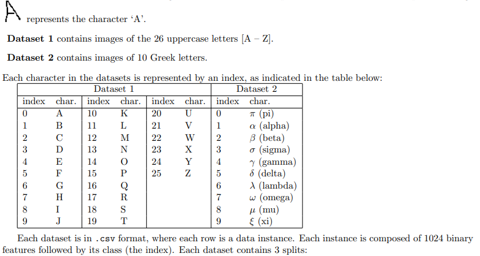

# comp-472-a1
 Artificial Intelligence Assignment 1

By Ihsaan Malek & Olivier Racette

The goal of the assignment was to run various machine learning models on two different datasets and compare the results.
The first data consisted of handwritten letters of the english alphabet and the second of some greek letters as shown below:

 
The models touched on for this assignment were a Gaussian Naive Bayes Classifier, Decision Trees, Perceptron(single and Multilayered)

Github URL: https://github.com/OliRac/comp-472-a1/  

Presentation Slides URL: https://docs.google.com/presentation/d/17Crirf4eG7VWfnM7QK7AcMtIyFd95D_KRtBkhfNagmE/edit#slide=id.g822dda0a4d_0_0
 
To run the program, run main.py through command line. Instructions on model execution will be shown. 
Example: main.py -visual gnb 1.
